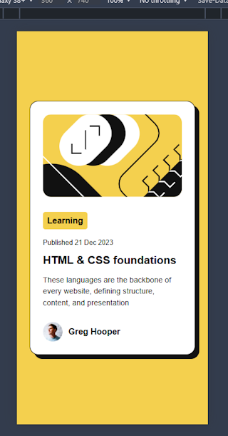

# Frontend Mentor - My Blog preview card implementation

This is my implementation to the [Blog preview card challenge on Frontend Mentor](https://www.frontendmentor.io/challenges/blog-preview-card-ckPaj01IcS). 
Frontend Mentor challenge. 

## Table of contents

- [Overview](#overview)
  - [The challenge](#the-challenge)
  - [Screenshot](#screenshot)
  - [Links](#links)
- [My process](#my-process)
  - [Built with](#built-with)
  - [What I learned](#what-i-learned)
  - [Continued development](#continued-development)
- [Author](#author)

**Note: Delete this note and update the table of contents based on what sections you keep.**

## Overview

A simple card for previewing a blob post. 

### The challenge

On the desktop view the title has a hover and focus state for all interactive elements on the page

### Screenshot



Mobile view of the card.

### Links

- Solution URL: [Add solution URL here](https://your-solution-url.com)
- Live Site URL: [Add live site URL here](https://your-live-site-url.com)

## My process

### Built with

- Semantic HTML5 markup
- PostCSS with the postcss-nesting plugin
- Flexbox
- Mobile-first workflow

### What I learned

- Using PostCSS with plugins
- Using the File Watchers feature in webStorm

```css
.author {
  display: flex;
  align-items: anchor-center;
}
```
This property gives better text alignment next to an image than `center`.

### Continued development

The next step would be to create a grid of these components and add a linking mechanism to the actual blog post. 

## Author

- Frontend Mentor - [Francis Judge](https://www.frontendmentor.io/profile/FJSolutions)
